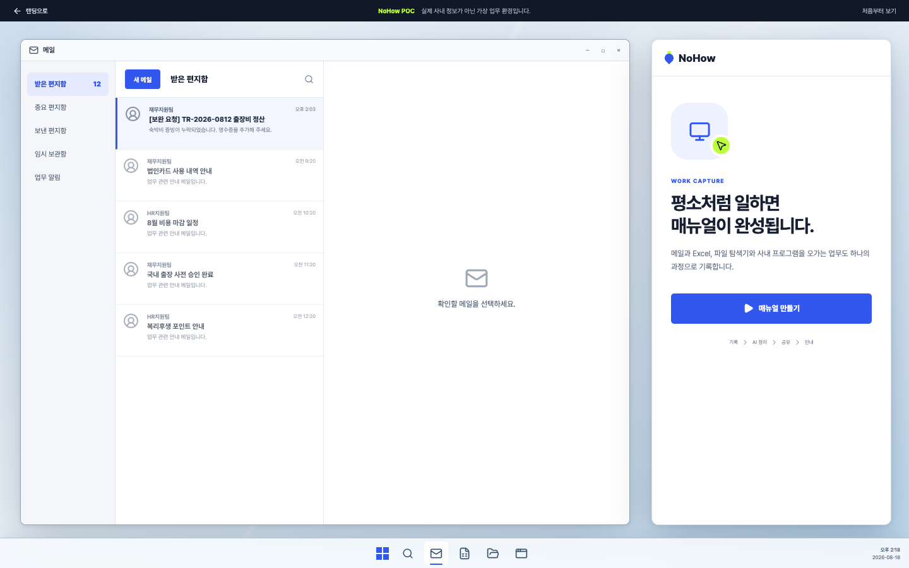
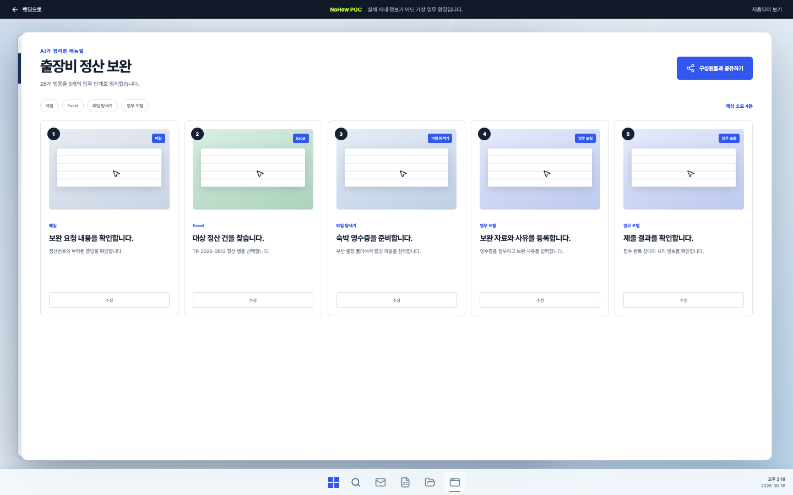

# NoHow

### 당신의 업무 경험을, 모두의 노하우로 남기세요.

평소처럼 업무를 수행하면 NoHow가 화면과 클릭, 프로그램 전환을 기록해 업무 매뉴얼로 정리합니다. 완성된 매뉴얼은 구성원들과 공유하고, 실제 업무 화면에서 단계별로 따라 할 수 있습니다.

[랜딩 페이지](https://stpcoder.github.io/nohow/) · [인터랙티브 데모](https://stpcoder.github.io/nohow/#/demo) · [데모 영상](https://stpcoder.github.io/nohow/nohow-demo.mp4)



## 해결하려는 문제

기록되지 않은 업무 경험은 조직에 남아 있지 않습니다. 누군가 이미 해결한 업무도 몇 달 뒤 다시 수행하려면 메일과 문서를 찾고, 동료에게 묻고, 여러 프로그램의 메뉴를 다시 익혀야 합니다.

NoHow는 매뉴얼을 만들기 위한 별도의 문서 작업 대신, 실제 업무를 수행하는 순간 그 과정을 다음 구성원이 사용할 수 있는 지식으로 바꿉니다.

## 네 가지 핵심 기능

1. **Work Capture** — 메일, Excel, 파일 탐색기, 사내 프로그램을 오가는 실제 업무 과정을 기록합니다.
2. **AI Structure** — 연속된 화면과 행동을 목적이 있는 업무 단계로 정리하고 설명을 생성합니다.
3. **Knowledge Sharing** — 사용자가 확인한 매뉴얼을 저장하고 다른 구성원들과 공유합니다.
4. **Live Guide** — 저장된 매뉴얼을 실제 업무 화면 위에서 단계별로 안내합니다.

## POC 시나리오

데모는 `출장비 정산 보완` 업무를 처음부터 끝까지 보여줍니다.

```text
보완 요청 메일 확인
→ Excel에서 정산 건 조회
→ 파일 탐색기에서 숙박 영수증 선택
→ 사내 포털에 증빙과 사유 제출
→ 28개 행동을 5단계 매뉴얼로 정리
→ 구성원들과 공유
→ 다른 구성원이 자연어로 검색
→ Live Guide를 따라 실제 화면에서 완료
```

각 매뉴얼 단계에는 실행할 앱, 화면, 해야 할 행동과 설명이 함께 표시됩니다. 사용자는 긴 문서나 영상을 별도로 열지 않고 현재 업무 화면에서 바로 다음 행동을 확인할 수 있습니다.



## 차별점

화면 녹화 도구는 영상을 남기고, 기존 매뉴얼은 사람이 캡처와 설명을 직접 작성해야 합니다. NoHow는 실제로 일하는 과정 자체를 구조화된 매뉴얼로 바꿉니다.

- 단순한 클릭 순서가 아니라 프로그램 전환과 연속된 행동의 맥락을 기록합니다.
- 결과물을 수정·검색·공유할 수 있는 업무 단계로 저장합니다.
- 매뉴얼을 보는 데서 끝나지 않고 실제 화면에서 수행할 수 있도록 연결합니다.
- 한 사람의 업무 경험을 다른 구성원이 바로 사용할 수 있는 조직 지식으로 확장합니다.

## 구현 범위

현재 POC에는 실제 DOM으로 만든 Windows 업무 환경과 NoHow 전 과정이 구현되어 있습니다. 모든 데모 상호작용은 실제 버튼, 입력창과 업무 화면을 사용합니다.

- 1440×900 Windows 데스크톱 POC
- Mail, Excel, File Explorer, 사내 포털 화면
- 업무 이벤트 기록과 앱 전환 표시
- AI Structure 로딩과 5단계 매뉴얼
- 공유 완료 및 다른 구성원의 자연어 검색
- 실제 화면의 단계별 Live Guide
- Playwright 기반 전체 동선 검증 및 데모 녹화

실제 운영 환경에서는 OS 접근성 API, 브라우저 확장 프로그램과 사내 인증·권한 체계를 연결하고, 민감한 입력값을 제외한 업무 이벤트를 정책에 맞게 저장해야 합니다.

## 로컬 실행

```bash
npm install
npm run dev
```

품질 검증과 영상 제작:

```bash
npm run lint
npm run build
NOHOW_SKIP_VIDEO=1 npm run capture
npm run capture
```

최종 영상은 H.264, yuv420p, 1440×900, 25fps로 제작됩니다. 자막은 흰색 Pretendard 한 줄을 원칙으로 하며, 화면 확대 없이 부드러운 커서 이동과 클릭 표시만 사용합니다.

## 주요 파일

| 파일 | 역할 |
| --- | --- |
| `src/Landing.tsx` | NoHow 소개와 데모 영상이 포함된 랜딩 페이지 |
| `src/Demo.tsx` | Windows 업무 환경과 전체 NoHow POC |
| `src/demo.css` | 인터랙티브 데모 전용 디자인 |
| `scripts/capture.mjs` | 전체 사용자 동선 검증과 1440×900 녹화 |
| `qa/video/captions.ass` | 한 줄 Pretendard 자막 |
| `qa/video/nohow-demo.mp4` | 랜딩 페이지에서 재생되는 최종 데모 영상 |

## Hackathon

2026 SK AI Hackathon · AI Solution League
