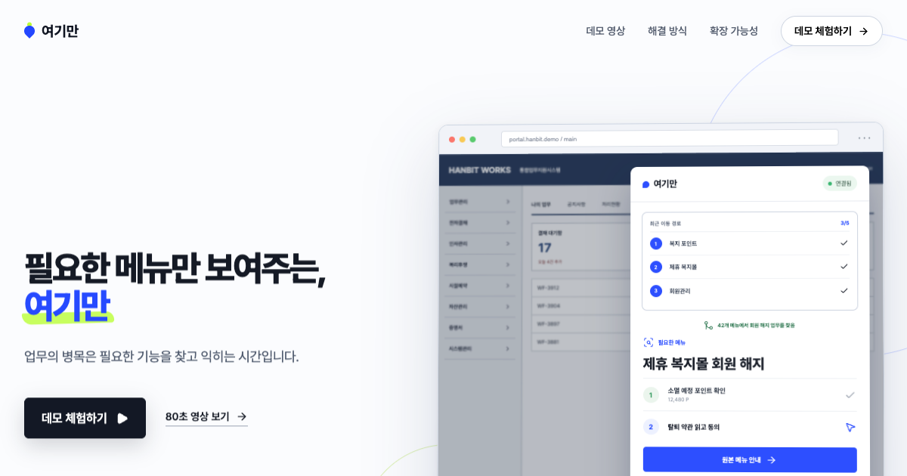
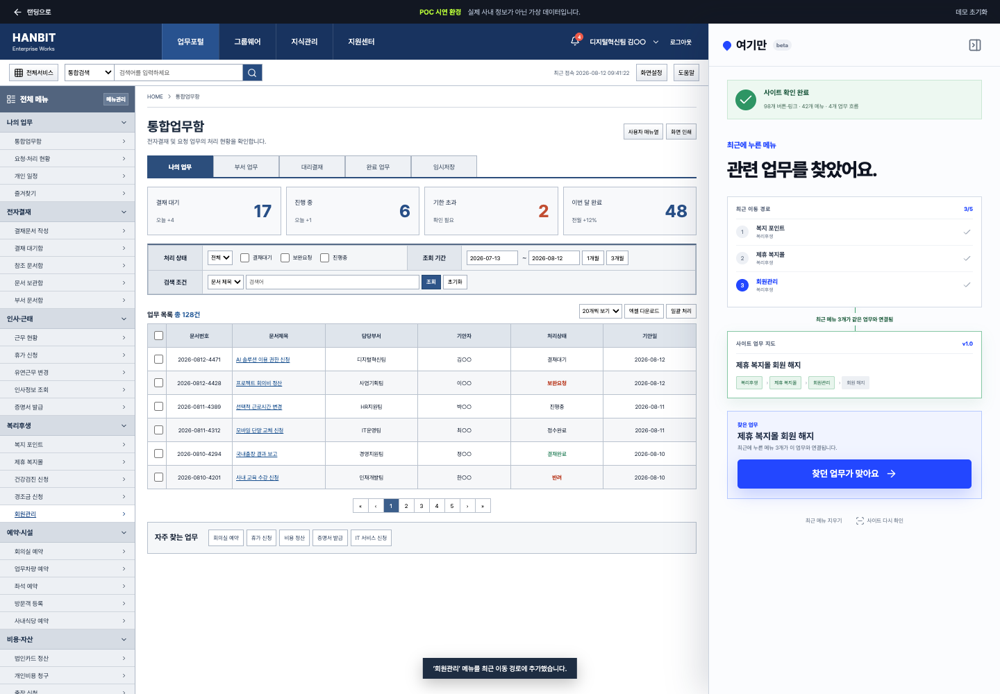

<div align="center">

# 여기만

### 필요한 메뉴만 보여주는, 여기만

업무의 병목은 필요한 기능을 찾고 익히는 시간입니다.<br />
여기만은 42개의 복잡한 메뉴를 필요한 3단계로 정리합니다.

[실행 데모](https://stpcoder.github.io/yogiman-ai/#/demo) · [전체 영상](https://github.com/stpcoder/yogiman-ai/releases/download/v0.2.1/yogiman-demo.mp4) · [확장 프로그램 다운로드](https://github.com/stpcoder/yogiman-ai/releases/latest)

</div>



## 전산 업무의 병목은 기능을 찾는 시간입니다

회사에 시스템이 늘어날수록 간단한 업무 하나를 처리하기 위해 거쳐야 할 화면도 늘어납니다. 사용자는 메뉴의 위치와 처리 순서를 익히고, 가끔 쓰는 업무를 할 때마다 그 경로를 다시 찾아야 합니다. 이 문제는 신규 입사자에게만 생기지 않습니다. 여러 해 동안 같은 회사에서 일한 숙련자도 자주 쓰지 않는 메뉴 앞에서는 다시 탐색을 시작합니다.

[Pega가 Global 2000 기업 운영지원 인력의 약 500만 시간에 이르는 데스크톱 활동을 분석한 결과](https://www.pega.com/about/news/press-releases/research-reveals-employees-switch-apps-over-1100-times-day), 조사 대상자는 하루 동안 업무 앱 사이를 1,100번 넘게 전환했습니다. 시스템이 많고 처리 경로가 길수록 사람의 시간은 업무 판단보다 화면 탐색에 사용됩니다.

여기만 POC는 이 문제를 다음 장면으로 보여줍니다.

```text
원본 사내 포털의 메뉴 42개
             ↓
   회원 해지에 필요한 3단계
             ↓
포인트 확인 → 약관 동의 → 직접 신청
```

`42개`는 업계 평균이 아니라 이 저장소의 가상 사내 포털에 구현된 메뉴 수입니다. 출처가 없는 평균 클릭 수를 만들지 않고, 외부 조사 수치와 POC에서 직접 확인할 수 있는 수치를 구분했습니다.

## 필요한 메뉴만 보여주고 실행 권한은 남겨 둡니다

여기만은 원본 시스템을 교체하거나 사용자를 대신해 업무를 처리하지 않습니다. AI가 복잡한 화면에서 목적과 관련된 기능을 찾고, 여기만 패널에는 필요한 메뉴와 처리 순서만 표시합니다. 사용자는 안내된 원본 메뉴로 이동해 내용을 확인하고 직접 클릭합니다.

회원 해지를 찾는 과정은 다음과 같습니다.

1. 사용자가 기존 시스템에서 `복지 포인트`, `제휴 복지몰`, `회원관리` 메뉴를 살펴봅니다.
2. 여기만이 최근 이동 경로를 등록된 업무 지도와 비교해 `회원 해지` 목적을 찾습니다.
3. 42개 메뉴 가운데 회원 해지에 필요한 세 단계를 보여줍니다.
4. 여기만이 원본 약관과 신청 버튼의 위치를 강조합니다.
5. 사용자가 약관을 읽고, 해지 사유를 선택하고, 최종 신청 버튼을 누릅니다.

AI는 체크박스, 제출, 결제, 승인과 탈퇴 버튼을 대신 누르지 않습니다. 필요한 위치를 정확히 찾는 일은 AI가 맡고, 중요한 판단과 실행은 사용자의 권한으로 남겨 둡니다.



## 사용 경로가 쌓일수록 업무 지도가 정확해집니다

복잡한 시스템의 모든 기능을 한 번에 완벽하게 분석한다고 가정하지 않습니다. 초기에는 화면 구조와 운영자가 알고 있는 처리 경로로 업무 지도를 시작하고, 실제 사용자가 반복해서 거친 메뉴 순서를 합산해 지도를 보완합니다.

```text
화면의 버튼·링크·메뉴를 연결합니다.
                 ↓
여러 사용자의 반복 경로를 익명으로 집계합니다.
                 ↓
AI가 공통 경로와 완료 지점을 업무 후보로 묶습니다.
                 ↓
운영자가 권한과 선행 조건을 확인하고 승인합니다.
                 ↓
승인된 경로만 필요한 사용자에게 안내합니다.
```

이렇게 만든 업무 지도는 메뉴 안내 외에도 다음 질문에 답할 수 있습니다.

- 직원들이 실제로 가장 자주 사용하는 처리 경로는 무엇인가?
- 같은 화면을 반복해서 오가며 시간이 지연되는 구간은 어디인가?
- 거의 사용되지 않는 메뉴와 중복된 기능은 무엇인가?
- 교육 자료와 시스템 개편에서 무엇을 먼저 고쳐야 하는가?

입력값, 문서 내용과 개인별 성과는 업무 지도에 저장하지 않습니다. 이용 경로는 개인 평가가 아니라 시스템 개선을 위해 집계하고, AI가 만든 경로는 운영자의 확인을 거친 뒤 배포합니다.

## 웹에서 시작해 사내 실행 프로그램으로 확장합니다

| 적용 대상 | 현재 상태 | 화면을 읽는 방법 |
| --- | --- | --- |
| 웹 사이트 | POC 구현 완료 | Chrome 확장 프로그램이 DOM과 접근성 이름을 읽습니다. |
| 사내 실행 프로그램 | 확장 설계 | Windows UI Automation과 macOS Accessibility API로 버튼과 화면 이동을 읽습니다. |

화면을 읽는 기술은 플랫폼마다 다르지만, 결과는 동일한 업무 지도 형식으로 저장할 수 있습니다. 업무 지도에는 기능의 이름, 원본 위치, 선행 단계, 권한과 주의가 필요한 행동이 포함됩니다. 따라서 웹에서 검증한 추천과 사용자 통제 원칙을 사내 실행 프로그램에도 그대로 적용할 수 있습니다.

현재 POC는 웹의 세 가지 업무 지도를 사람이 직접 검수해 등록했습니다. 사용 경로 집계, AI 기반 업무 후보 생성과 데스크톱 프로그램 연결은 전사 적용을 위한 다음 단계이며, 구현 완료 기능처럼 표시하지 않습니다.

## 직접 체험하기

[실행 데모](https://stpcoder.github.io/yogiman-ai/#/demo)를 열고 다음 순서대로 진행하세요.

1. `사이트 안전 탐색 시작`을 누릅니다.
2. 왼쪽 포털에서 `복지 포인트`, `제휴 복지몰`, `회원관리`를 차례로 누릅니다.
3. 여기만이 최근 이동 경로를 업무 지도와 연결해 회원 해지 목적을 찾는 과정을 확인합니다.
4. 추천된 세 단계를 따라 원본 약관과 신청 화면으로 이동합니다.
5. 약관 확인, 해지 사유 선택과 최종 신청을 직접 진행합니다.

전체 시나리오는 약 80초이며, 마지막 성공 화면까지 실제로 작동합니다.

## 로컬에서 실행하기

Node.js 20 이상과 Chrome이 필요합니다.

```bash
npm install
npm run dev
```

브라우저에서 `http://127.0.0.1:5173/yogiman-ai/`을 엽니다. 다음 명령으로 코드, 업무 추천 로직, 빌드와 화면을 검증할 수 있습니다.

```bash
npm run lint
npm run test:intent
npm run build
npm run capture
```

## 크롬 확장 프로그램 설치

1. [최신 릴리스](https://github.com/stpcoder/yogiman-ai/releases/latest)에서 확장 프로그램 ZIP 파일을 내려받고 압축을 풉니다.
2. Chrome에서 `chrome://extensions`를 엽니다.
3. 오른쪽 위의 `개발자 모드`를 켭니다.
4. `압축해제된 확장 프로그램을 로드합니다`를 누릅니다.
5. 압축을 푼 `extension` 폴더를 선택합니다.

확장 프로그램은 사용자가 연 현재 탭에서만 작동합니다. 최근 메뉴 기록은 탭의 세션에만 저장되며, 패널의 `최근 메뉴 지우기`로 즉시 삭제할 수 있습니다.

## 저장소 구성

| 경로 | 내용 |
| --- | --- |
| `src/Demo.tsx` | 가상 포털과 전체 시연 흐름 |
| `src/intent-engine.ts` | 사용자 목적과 업무 지도를 비교하는 코드 |
| `extension/` | 설치 가능한 Chrome Manifest V3 확장 프로그램 |
| `docs/ARCHITECTURE.md` | 업무 지도 생성과 전사 적용 구조 |
| `SUBMISSION_DRAFT.md` | AI Idea 리그 제출 글 |
| `PRODUCT_PLAN.md` | 제품 범위와 파일럿 계획 |
| `qa/video/yogiman-demo.mp4` | Playwright로 녹화한 전체 시연 영상 |

## 공개 범위

`HANBIT Enterprise Works`는 이 POC를 위해 직접 만든 가상 포털입니다. 저장소에는 가상 또는 마스킹 데이터만 포함되어 있습니다. 실제 사내 화면, 내부 주소, 임직원 정보, 고객 정보와 API 키는 포함하지 않았습니다.

오픈소스와 폰트 출처는 [Third-party notices](THIRD_PARTY_NOTICES.md)에 정리했습니다. 코드는 [MIT License](LICENSE)로 공개합니다.
