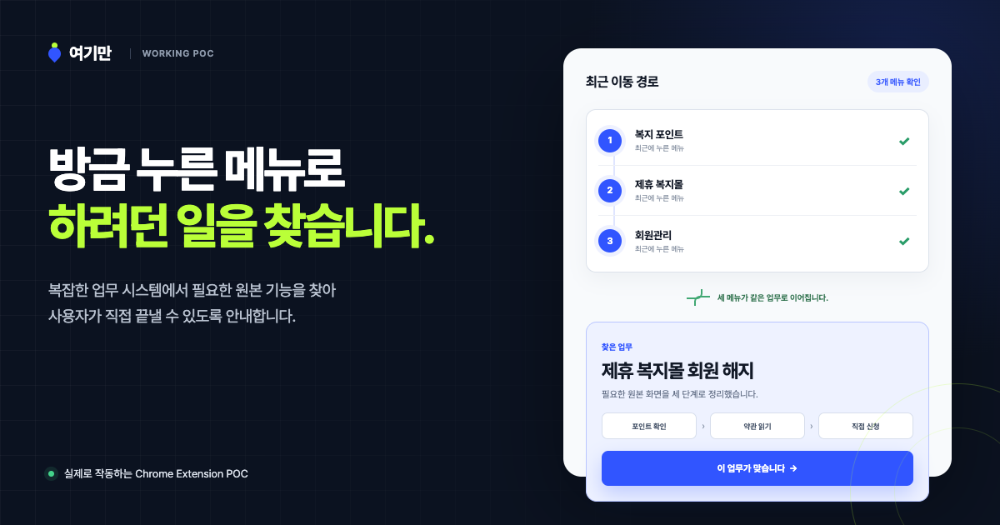

<div align="center">

# 여기만

### 방금 누른 메뉴로 하려던 일을 찾습니다.

복잡한 업무 웹에서 최근 이동 경로를 확인하고,<br />지금 필요한 원본 기능을 한 화면에 정리해 주는 크롬 확장 프로그램입니다.

[실행 데모](https://stpcoder.github.io/yogiman-ai/#/demo) · [전체 영상](https://github.com/stpcoder/yogiman-ai/releases/download/v0.2.1/yogiman-demo.mp4) · [확장 프로그램 다운로드](https://github.com/stpcoder/yogiman-ai/releases/latest)

</div>



## 42개 메뉴에서 필요한 업무를 찾았습니다

사내 시스템에서 가끔 하는 업무는 메뉴 위치부터 다시 찾아야 합니다. 여기만을 열고 기존 시스템을 평소처럼 살펴보세요. 최근에 누른 메뉴가 같은 업무로 이어지면, 여기만이 하려던 일을 찾아 필요한 순서를 보여줍니다.

회원 해지를 찾는 장면은 이렇게 진행됩니다.

```text
복지 포인트 → 제휴 복지몰 → 회원관리
                          ↓
                  제휴 복지몰 회원 해지
                          ↓
             포인트 확인 → 약관 읽기 → 직접 신청
```

여기만은 어떤 메뉴를 근거로 업무를 찾았는지 함께 보여줍니다. 사용자는 제안이 맞는지 확인한 뒤 원본 화면에서 약관을 읽고 최종 신청을 진행합니다.


## 직접 체험하기

[실행 데모](https://stpcoder.github.io/yogiman-ai/#/demo)를 열고 다음 순서대로 진행하세요.

1. `사이트 안전 탐색 시작`을 누릅니다.
2. 왼쪽 메뉴에서 `복지 포인트`를 누릅니다.
3. 이어서 `제휴 복지몰`과 `회원관리`를 누릅니다.
4. 오른쪽 패널에서 찾은 업무와 판단에 사용한 메뉴를 확인합니다.
5. `찾던 업무가 맞아요`를 누르고 안내된 세 단계를 따라갑니다.

전체 시나리오는 약 80초이며, 원본 약관 확인부터 최종 신청까지 직접 체험할 수 있습니다.

## 어떻게 작동하나요?

### 1. 사이트의 업무 지도를 준비합니다

여기만은 메뉴, 버튼, 화면 이동과 주의가 필요한 행동을 업무별로 연결합니다. 현재 POC에는 회원 해지, 회의실 예약, 비용 정산이 등록되어 있습니다.

### 2. 최근에 누른 메뉴를 확인합니다

클릭한 메뉴 이름을 현재 탭에 최대 5개까지 보관합니다. 검색어, 입력값과 문서 내용은 수집하지 않습니다.

### 3. 같은 업무로 이어지는 메뉴를 찾습니다

서로 다른 메뉴 세 개가 같은 업무 경로와 연결되면 해당 업무를 제안합니다. 제안 화면에는 실제로 판단에 사용한 메뉴가 표시됩니다.

### 4. 원본 화면으로 안내합니다

업무에 필요한 순서를 정리하고 실제 약관, 입력 항목과 실행 버튼의 위치를 강조합니다. 탈퇴, 결제, 제출과 승인 버튼은 사용자가 직접 누릅니다.

자세한 구현 구조는 [아키텍처 문서](docs/ARCHITECTURE.md)에 정리했습니다.

## AI는 어디에 사용하나요?

이번 POC는 Codex를 사용해 요구사항 정리, React와 크롬 확장 프로그램 구현, Playwright 검증, 시연 영상과 문서 제작을 진행했습니다. 생성된 결과는 실제 브라우저에서 반복 실행하고 사람이 최종 검토했습니다.

제품을 사내 시스템에 연결할 때는 AI가 메뉴 이름과 화면 관계를 읽어 업무 지도 초안을 만듭니다. 시스템 운영자는 실제 경로, 권한, 선행 조건과 주의 행동을 확인합니다. 검수가 끝난 지도만 사용자에게 배포합니다.

현재 POC의 사용자 화면은 결과를 반복해서 확인할 수 있도록 세 개의 업무 지도를 직접 작성했습니다. 아직 연결하지 않은 사내 AI나 모델을 사용했다고 표시하지 않습니다.

## 로컬에서 실행하기

Node.js 20 이상과 Chrome이 필요합니다.

```bash
npm install
npm run dev
```

브라우저에서 `http://127.0.0.1:5173/yogiman-ai/`을 엽니다.

검증 명령은 다음과 같습니다.

```bash
npm run lint
npm run test:intent
npm run build
npm run capture
```

## 크롬 확장 프로그램 설치

1. [최신 릴리스](https://github.com/stpcoder/yogiman-ai/releases/latest)에서 `yogiman-extension-0.2.1.zip`을 내려받고 압축을 풉니다.
2. Chrome에서 `chrome://extensions`를 엽니다.
3. 오른쪽 위의 `개발자 모드`를 켭니다.
4. `압축해제된 확장 프로그램을 로드합니다`를 누릅니다.
5. 압축을 푼 `extension` 폴더를 선택합니다.

확장 프로그램은 사용자가 연 현재 탭에서만 작동합니다. 최근 메뉴 기록은 탭의 세션에 저장되며 브라우저를 다시 시작하면 유지되지 않습니다. 패널의 `최근 메뉴 지우기`로 바로 삭제할 수 있습니다.

## 저장소 구성

| 경로 | 내용 |
| --- | --- |
| `src/Demo.tsx` | 가상 포털과 전체 시연 흐름 |
| `src/intent-engine.ts` | 최근 메뉴와 업무 지도를 비교하는 코드 |
| `extension/` | 설치 가능한 Chrome Manifest V3 확장 프로그램 |
| `docs/ARCHITECTURE.md` | 업무 지도 생성과 전사 적용 구조 |
| `SUBMISSION_DRAFT.md` | AI Idea 리그 제출 글 |
| `PRODUCT_PLAN.md` | 제품 범위와 파일럿 계획 |
| `qa/video/yogiman-demo.mp4` | Playwright로 녹화한 전체 시연 영상 |

## 공개 범위

`HANBIT Enterprise Works`는 이 POC를 위해 직접 만든 가상 포털입니다. 저장소에는 가상 또는 마스킹 데이터만 포함되어 있습니다. 실제 사내 화면, 내부 주소, 임직원 정보, 고객 정보와 API 키는 포함하지 않았습니다.

오픈소스와 폰트 출처는 [Third-party notices](THIRD_PARTY_NOTICES.md)에 정리했습니다. 코드는 [MIT License](LICENSE)로 공개합니다.
