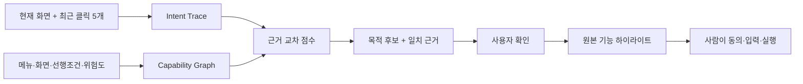

# 여기만

> **여기까지 온 경로가 곧 프롬프트입니다.**

`여기만`은 복잡한 업무 웹에서 사용자가 방금 누른 메뉴와 현재 화면을 사이트의 기능 지도에 겹쳐, 하려던 업무를 근거와 함께 복원하는 Human-in-the-loop Chrome Side Panel입니다.


## 이 POC의 Wow Moment

채팅창에 목적을 다시 설명하지 않습니다.

1. 사용자가 원래 포털에서 `복지 포인트 → 제휴 복지몰 → 회원관리`를 누릅니다.
2. 여기만은 이 세 번의 클릭을 탭 안의 `Intent Trace`로 보존합니다.
3. 미리 검수된 `Capability Graph`와 겹치는 지점을 점수화합니다.
4. `제휴 복지몰 회원 해지`라는 목적과 일치한 근거 3개를 함께 보여줍니다.
5. 사용자가 목적을 확인하면 포인트 확인, 약관 읽기, 직접 신청의 원본 단계만 연결합니다.

AI가 “알아서 추천했다”는 검은 상자를 만들지 않습니다. 무엇을 보고 판단했는지 화면에 그대로 남고, 약관 동의와 최종 신청은 사람이 수행합니다.

## 작동하는 핵심 구조



- `Intent Trace` — 클릭한 요소의 이름, 페이지 문맥, 시각만 탭별 세션에 최대 5개 저장합니다. 입력창 값은 읽거나 저장하지 않습니다.
- `Capability Graph` — 업무 이름, 실제 메뉴 경로, 선행 조건, 위험도를 시스템별로 버전 관리합니다.
- `Evidence Resolver` — 각 클릭과 그래프 신호의 가중 교집합을 계산하고, 서로 다른 근거 3개와 임계점을 모두 넘을 때만 목적을 제안합니다.
- `Human Gate` — 탈퇴·삭제·결제·제출은 원본 위치까지만 안내하고 자동 클릭하지 않습니다.

현재 공개 POC는 재현 가능한 가중 점수 방식으로 동작합니다. 연결되지 않은 LLM을 연결됐다고 주장하지 않습니다. 사내 적용 시 AI는 DOM 라벨을 공통 업무 용어로 정규화하고 그래프 초안을 만드는 온보딩 단계에 사용할 수 있으며, 운영자가 승인한 그래프만 런타임에 배포합니다. 자세한 내용은 [아키텍처 문서](docs/ARCHITECTURE.md)를 참고하세요.

## 바로 실행하기

요구 사항: Node.js 20 이상, Chrome.

```bash
npm install
npm run dev
```

브라우저에서 `http://127.0.0.1:5173/yogiman-ai/`을 열고 `3분 데모 시작`을 누릅니다.

검증:

```bash
npm run lint
npm run build
npm run test:intent
npm run capture
```

## 45초 핵심 시나리오

1. `사이트 안전 탐색 시작`을 누릅니다.
2. 왼쪽 원본 포털에서 `복지 포인트`, `제휴 복지몰`, `회원관리`를 차례로 누릅니다.
3. 오른쪽에서 세 클릭이 `제휴 복지몰 회원 해지` 노드와 만나는 장면을 확인합니다.
4. `이 목적이 맞아요`를 누릅니다.
5. 여기만이 제시한 3단계를 따라 원본 약관과 체크박스로 이동합니다.
6. 사용자가 직접 해지 사유를 선택하고 동의한 뒤 최종 신청합니다.

[전체 데모 영상 보기](qa/video/yogiman-demo.mp4)

## Chrome 확장 프로그램 설치

1. Chrome에서 `chrome://extensions`를 엽니다.
2. `개발자 모드`를 켭니다.
3. `압축해제된 확장 프로그램을 로드합니다`를 누릅니다.
4. 이 저장소의 `extension` 폴더를 선택합니다.
5. 일반 웹페이지에서 툴바의 `여기만`을 누르고 안전 탐색을 시작합니다.

확장 프로그램은 `activeTab`, `scripting`, `sidePanel`, `storage` 권한을 사용합니다. 클릭 흔적은 `chrome.storage.session`에 탭별로 최대 5개만 보존되며 브라우저 재시작 후 유지되지 않습니다.

## 전사 확장 방식

전사 확장의 단위는 프롬프트나 화면별 재개발이 아니라, 검수된 작은 그래프 패키지입니다.

```text
공통 업무 ID: BENEFIT_MEMBERSHIP_WITHDRAW
├─ 멤버사 A: 복리후생 › 제휴몰 › 회원관리
├─ 멤버사 B: My HR › Benefit › 서비스 해지
└─ 멤버사 C: 구성원 지원 › 포인트몰 › 이용 종료
```

각 멤버사의 다른 메뉴 이름을 같은 업무 ID에 매핑하면 Intent Trace 해석기와 Human Gate는 그대로 재사용할 수 있습니다. 시스템 변경 시에는 그래프 버전만 재검수하며, 사용자의 입력 데이터나 사내 문서를 중앙으로 수집할 필요가 없습니다.

## 저장소 구성

- `src/intent-engine.ts` — 실제 Intent Trace × Capability Graph 교차 엔진
- `src/Demo.tsx` — 가상 레거시 포털과 작동하는 웹 POC
- `extension/` — 설치 가능한 Manifest V3 Side Panel 확장
- `docs/ARCHITECTURE.md` — 런타임, 온보딩, 보안, 전사 확장 설계
- `PRODUCT_PLAN.md` — 제품 원칙과 파일럿 계획
- `SUBMISSION_DRAFT.md` — AI Idea 리그 제출 본문
- `scripts/capture.mjs` — 실제 Playwright 동작 기반 데모 녹화와 QA
- `qa/video/yogiman-demo.mp4` — 흰색 Pretendard 자막을 포함한 최종 시연 영상

## 공개 안전성

- `HANBIT Enterprise Works`는 시연을 위해 만든 가상 포털입니다.
- 이름·사번·업무 데이터는 가상 또는 마스킹 정보입니다.
- 실제 사내 화면, 내부 URL, 고객 데이터, 개인정보, API 키를 포함하지 않습니다.
- 오픈소스와 폰트 출처는 [Third-party notices](THIRD_PARTY_NOTICES.md)에 정리했습니다.

## License

MIT License. 자세한 내용은 [LICENSE](LICENSE)를 참고하세요.
