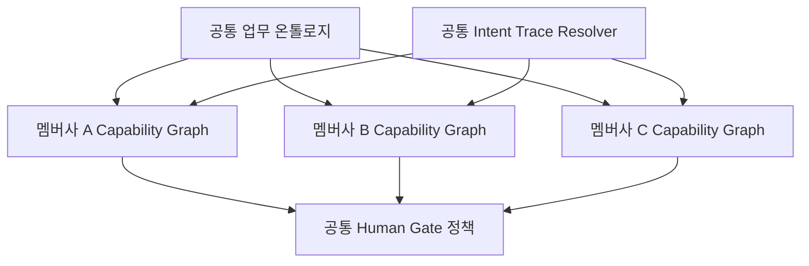

# Intent Trace × Capability Graph

## 한 문장

사용자가 하던 행동을 짧은 `Intent Trace`로 만들고, 운영자가 승인한 `Capability Graph`와 교차해 설명 가능한 목적 후보를 제시합니다.

## 런타임

### 1. Intent Trace

확장 프로그램은 사용자가 클릭한 버튼·링크·메뉴에서 다음 정보만 수집합니다.

```json
{
  "label": "회원관리",
  "group": "복리후생",
  "kind": "메뉴",
  "path": "/portal/main",
  "at": 1786582800000
}
```

- 탭별 최근 5개만 `chrome.storage.session`에 저장
- 클릭한 요소의 보이는 이름만 사용
- 입력창 값, 문서 본문, 비밀번호, 폼 데이터는 사용하지 않음
- 사용자가 언제든 흔적 삭제 가능

### 2. Capability Graph

그래프 노드는 사람이 실제로 수행할 수 있는 업무와 원본 화면을 나타냅니다.

```json
{
  "id": "BENEFIT_MEMBERSHIP_WITHDRAW",
  "title": "제휴 복지몰 회원 해지",
  "path": ["복리후생", "제휴 복지몰", "회원관리", "회원 해지"],
  "signals": ["복지 포인트", "제휴 복지몰", "회원관리", "해지"],
  "risk": "confirm"
}
```

노드에는 업무 ID, 메뉴 경로, 선행 조건, 실행 위험도, 원본 요소 참조, 소유 부서와 그래프 버전을 둘 수 있습니다.

### 3. Evidence Resolver

POC의 점수는 의도적으로 단순하고 확인할 수 있습니다.

```text
score(task) = Σ traceEvent × Σ matchedSignalWeight

제안 조건
1. 서로 다른 클릭 근거 3개 이상
2. 해당 업무의 점수 임계값 15 이상
3. 실행 전 사용자 확인
```

모델의 자신감 숫자를 보여주는 대신 실제로 일치한 클릭과 그래프 경로를 보여줍니다. 조건을 넘지 못하면 사용자가 원래 웹을 더 탐색하도록 기다리거나 목적 후보를 직접 선택하게 합니다.

## 시스템 온보딩

1. 읽기 전용 크롤러가 메뉴, route, role, label과 폼 경계를 수집합니다.
2. 보안 승인 AI가 라벨을 그룹 공통 업무 용어로 정규화하고 그래프 초안을 만듭니다.
3. 시스템 운영자가 경로, 권한, 선행 조건과 위험도를 검수합니다.
4. 승인된 그래프를 서명·버전 관리해 확장 프로그램에 배포합니다.
5. DOM 또는 route 변경을 감지하면 관련 노드만 재검수합니다.

AI는 매 사용자 요청마다 사이트를 무작정 클릭하는 실행자가 아니라, 시스템을 한 번 구조화하는 `Graph Compiler` 역할을 맡습니다. 런타임은 승인된 그래프 안에서만 동작하므로 비용, 지연, 오작동 범위를 줄일 수 있습니다.

## 그룹 확장

서로 다른 시스템의 메뉴를 공통 업무 ID에 연결합니다.



새 멤버사를 추가할 때는 공통 Resolver를 다시 만들지 않고 그 시스템의 그래프 어댑터만 추가합니다. 탈퇴, 결제, 제출처럼 위험한 공통 업무 ID에는 그룹 공통 Human Gate 정책을 적용할 수 있습니다.

## 현재 구현과 다음 단계

현재 저장소에서 실제로 작동하는 부분:

- 클릭 이벤트의 탭별 세션 저장
- 입력값을 제외한 DOM 인벤토리
- 3개 업무 노드의 Capability Graph
- 가중 교집합과 3근거 임계값
- 근거와 그래프 경로 시각화
- 원본 요소 스크롤·하이라이트
- 위험 작업 자동 클릭 금지

파일럿에서 추가할 부분:

- 승인형 Graph Compiler와 운영자 검수 화면
- 그래프 서명, 소유자, 변경 이력
- 사내 권한 시스템과 노드 접근 권한 연동
- 공통 업무 온톨로지와 멤버사별 어댑터 레지스트리
- 익명화된 성공률·시간·오클릭 지표
