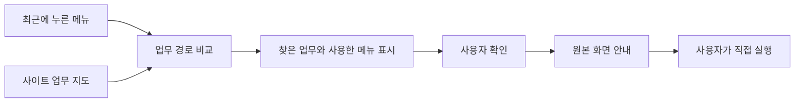
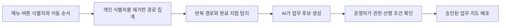

# 여기만 구현 구조

## 전체 흐름

여기만은 사용자가 최근에 누른 메뉴를 사이트의 업무 지도와 비교해 필요한 업무를 찾습니다.



## 최근 이동 경로

확장 프로그램은 클릭한 메뉴와 버튼에서 다음 정보만 기록합니다.

```json
{
  "label": "회원관리",
  "group": "복리후생",
  "kind": "메뉴",
  "path": "/portal/main",
  "at": 1786582800000
}
```

기록은 탭별 세션에 최대 5개까지 저장합니다. 클릭한 요소의 보이는 이름과 현재 화면 주소만 사용합니다. 검색어, 텍스트 입력값, 비밀번호와 문서 본문은 기록하지 않습니다. 사용자는 패널에서 기록을 바로 지울 수 있습니다.

## 사이트 업무 지도

업무 지도에는 사용자가 실제로 처리할 업무와 원본 화면을 연결합니다.

```json
{
  "id": "BENEFIT_MEMBERSHIP_WITHDRAW",
  "title": "제휴 복지몰 회원 해지",
  "path": ["복리후생", "제휴 복지몰", "회원관리", "회원 해지"],
  "signals": ["복지 포인트", "제휴 복지몰", "회원관리", "해지"],
  "risk": "confirm"
}
```

각 업무에는 다음 정보를 저장할 수 있습니다.

- 그룹에서 공통으로 사용할 업무 ID
- 사용자가 보는 업무 이름
- 실제 메뉴와 화면 경로
- 먼저 확인해야 하는 내용
- 원본 입력 항목과 실행 버튼
- 주의가 필요한 행동
- 업무 지도의 버전과 담당 부서

## 업무 선택 기준

POC는 각 업무에 연결된 메뉴가 최근 이동 경로에 포함돼 있는지 확인합니다. 메뉴마다 가중치를 더하고 다음 두 조건을 모두 만족하면 업무를 제안합니다.

1. 서로 다른 메뉴가 세 개 이상 연결됩니다.
2. 해당 업무의 합산 점수가 15점 이상입니다.

회원 해지 예시는 다음과 같습니다.

```text
복지 포인트 4점 + 제휴 복지몰 5점 + 회원관리 6점 = 15점
```

사용자 화면에는 점수보다 판단에 사용한 세 메뉴를 우선 표시합니다. 업무를 확정하기 전에는 사용자의 확인을 받습니다.

## 새로운 시스템 연결

실제 사내 시스템에는 다음 순서로 적용합니다.

1. 읽기 전용 수집기가 메뉴 이름, 화면 제목, 주소, 버튼 역할과 입력 화면을 확인합니다.
2. 보안 승인을 받은 AI가 같은 업무에 속하는 메뉴와 화면을 묶어 업무 지도 초안을 만듭니다.
3. 시스템 운영자가 실제 메뉴 경로와 사용자 권한을 확인합니다.
4. 먼저 확인해야 하는 내용과 주의가 필요한 행동을 지정합니다.
5. 검수가 끝난 업무 지도를 버전으로 저장하고 배포합니다.
6. 화면이 바뀌면 변경된 업무 경로만 다시 확인합니다.

AI가 만든 초안은 운영자 검수 전까지 사용자에게 배포하지 않습니다. 사용 중에는 승인된 업무 지도 안에서만 업무를 찾습니다.

## 사용 경로로 업무 지도를 보완하는 방법

한 번의 자동 탐색으로 복잡한 시스템의 모든 업무를 완벽하게 파악한다고 가정하지 않습니다. 초기 업무 지도는 화면 구조와 운영자가 알고 있는 경로로 만들고, 여러 사용자가 실제로 거친 경로를 집계해 다음 순서로 보완합니다.



수집 대상은 화면 요소의 식별자, 이동 순서와 업무 완료 여부입니다. 입력값, 문서 내용과 개인별 성과는 저장하지 않습니다. 이 데이터로 자주 쓰는 경로, 반복해서 되돌아가는 구간과 거의 사용되지 않는 메뉴를 확인할 수 있습니다. 결과는 개인 평가가 아니라 교육 자료와 시스템 개선 우선순위를 정하는 데 사용합니다.

현재 POC는 이 과정을 반복해서 검증할 수 있도록 세 개의 업무 지도를 직접 정의했습니다. 경로 집계, AI 기반 업무 후보 생성과 운영자 승인 화면은 파일럿에서 구현합니다.

## 웹과 사내 실행 프로그램 연결

업무 지도 형식과 사용자 확인 원칙은 플랫폼에 관계없이 같습니다. 화면 요소를 읽는 어댑터만 달라집니다.

| 적용 대상 | 화면 요소를 읽는 방법 | 상태 |
| --- | --- | --- |
| 웹 사이트 | Chrome 확장 프로그램이 DOM과 접근성 이름을 읽습니다. | POC 구현 완료 |
| Windows 실행 프로그램 | UI Automation으로 컨트롤 이름, 역할과 화면 이동을 읽습니다. | 확장 설계 |
| macOS 실행 프로그램 | Accessibility API로 컨트롤 이름, 역할과 화면 이동을 읽습니다. | 확장 설계 |

플랫폼 어댑터는 화면 요소를 공통 형식으로 변환합니다. 추천 엔진은 공통 업무 ID와 승인된 경로를 사용하며, 약관 동의와 최종 실행 버튼은 어느 플랫폼에서도 자동으로 누르지 않습니다.

## 여러 멤버사에 적용

그룹에서 공통 업무 이름을 먼저 정합니다. 각 멤버사는 실제 시스템의 메뉴 경로를 공통 업무에 연결합니다.

```text
공통 업무: 복지몰 회원 해지

멤버사 A  복리후생 > 제휴몰 > 회원관리
멤버사 B  My HR > Benefit > 서비스 해지
멤버사 C  구성원 지원 > 포인트몰 > 이용 종료
```

새로운 멤버사를 추가할 때는 해당 시스템의 업무 지도만 작성합니다. 최근 이동 경로를 비교하는 코드, 사용자 확인 화면과 주의 행동 기준은 공통으로 사용할 수 있습니다.

## 현재 구현된 범위

- 클릭한 메뉴를 탭별 세션에 저장합니다.
- 텍스트 입력값을 제외한 메뉴와 버튼을 읽습니다.
- 회원 해지, 회의실 예약, 비용 정산 업무 지도가 있습니다.
- 최근 메뉴 세 개와 합산 점수로 업무를 제안합니다.
- 판단에 사용한 메뉴와 원본 경로를 보여줍니다.
- 원본 화면으로 이동하고 관련 요소를 강조합니다.
- 탈퇴, 결제, 제출 버튼은 자동으로 누르지 않습니다.

## 파일럿에서 추가할 범위

- AI가 만든 업무 지도 초안을 검수하는 운영자 화면
- 여러 사용자의 익명화된 이용 경로 집계
- 반복 경로와 완료 지점을 업무 후보로 묶는 기능
- 업무 지도 담당자, 승인 상태와 변경 이력
- 사내 권한에 따른 메뉴 노출 제어
- 그룹 공통 업무 목록과 멤버사별 경로 관리
- Windows UI Automation과 macOS Accessibility API 어댑터
- 업무 성공률, 완료 시간과 잘못 누른 메뉴 수 측정
